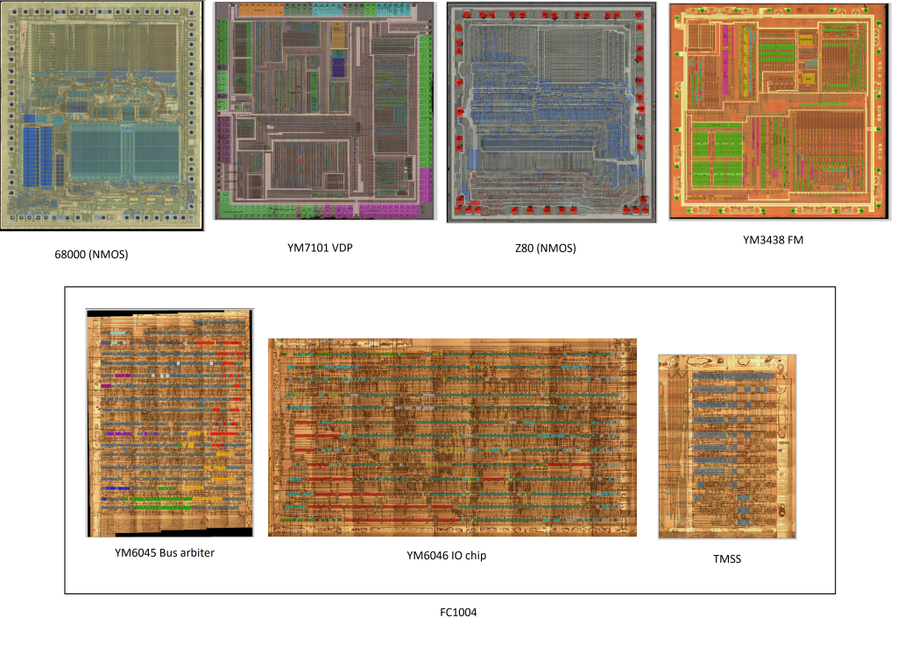
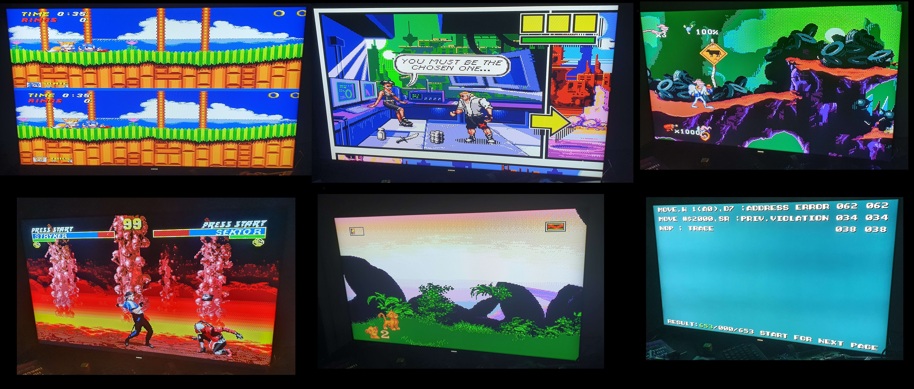

# Nuked-MD-FPGA

by @nukeykt, @ogamespec and @andkorzh, special thanks to @HardWrMan

Cycle accurate Mega Drive emulator. Verilog version of [Nuked MD](https://github.com/nukeykt/Nuked-MD).
The goal of this project is to emulate Sega Mega Drive chipset accurately as possible using decapped chips photos.

## Mega Drive chipset
Sega Mega Drive chipset consist of 6 integrated circuits + RAM chips:
* Motorola 68000 (Main CPU)
* Zilog Z80 (Sound CPU)
* Yamaha YM7101 (VDP)
* Yamaha YM2612/YM3438 (FM)
* Yamaha YM6045 (Arbiter)
* Yamaha YM6046 (IO)
* TMSS (later revisions)

There are number of variations of chipsets across mega drive revisions. For example early revisions use NMOS 68k and Z80 chips, while later models switched to CMOS versions. Yamaha later integrated their chips into one big chip named FC1004.

Nuked-MD-FPGA currently targets NMOS 68k, NMOS Z80 and FC1004. No real mega drive used such combination, but Model 1 VA7 would be closest (CMOS 68k, NMOS Z80 and FC1004). Other variants possibly will be emulated in the future.

## Progress

See [Progress.md](Progress.md)

## References
* https://github.com/emu-russia/SEGAChips (andkorzh, org, nukeykt)
* https://www.grafik-feti.de/ftp/Die-Shots/Archiv/2D/Die-Shots/GamingConsoles/SEGA_Genesis_MegaDrive/MD1/VDP/ (Fritzchens Fritz)
* https://siliconpr0n.org/map/yamaha/ym3438/ (John McMaster)
* http://gendev.spritesmind.net/forum/viewtopic.php?p=14976&sid=d3409eec616d569e2240c09d60bbff03#p14976 (HardWareMan)
* https://siliconpr0n.org/map/zilog/z0840008psc-z80cpu/ (Antoine Bercovici)
* https://siliconpr0n.org/map/motorola/mc68000p8-a72e/ (John McMaster)
* https://og.kervella.org/m68k/ (Olivier Galibert)
* http://www.visual6502.org/JSSim/expert-z80.html (Visual6502 team)
* https://siliconpr0n.org/map/hitachi/hd68hc000u (John McMaster)

## Credits
* nukeykt - RE, verilog implementation
* org(ogamespec) - FC1004 decap, RE, useful tools, etc.
* andkorzh - RE
* HardWareMan - YM2612 decap pics, RE
